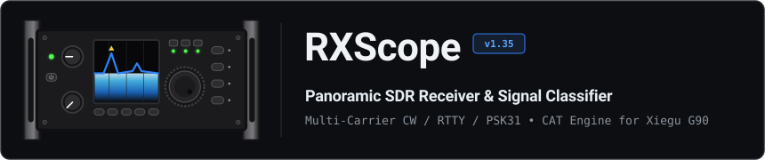
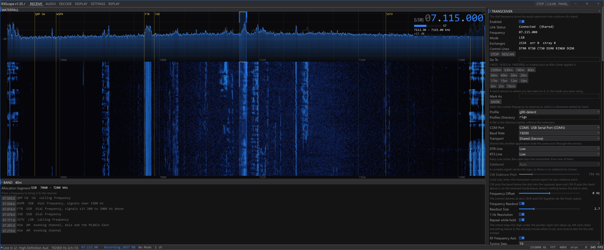
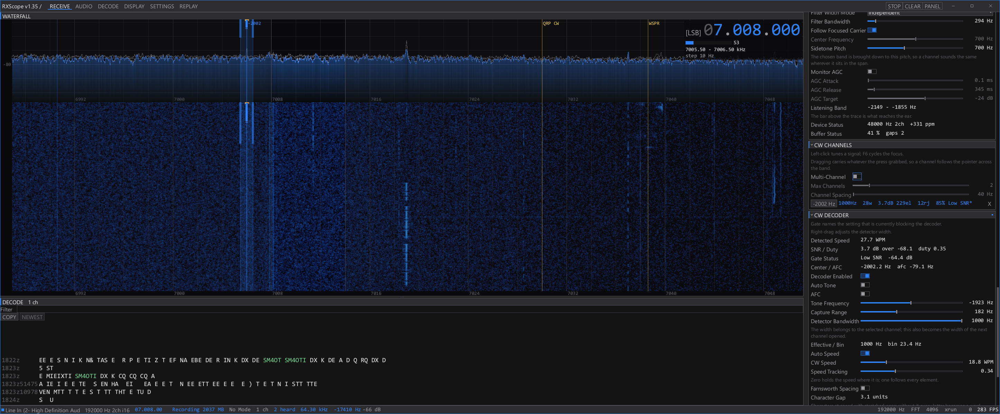
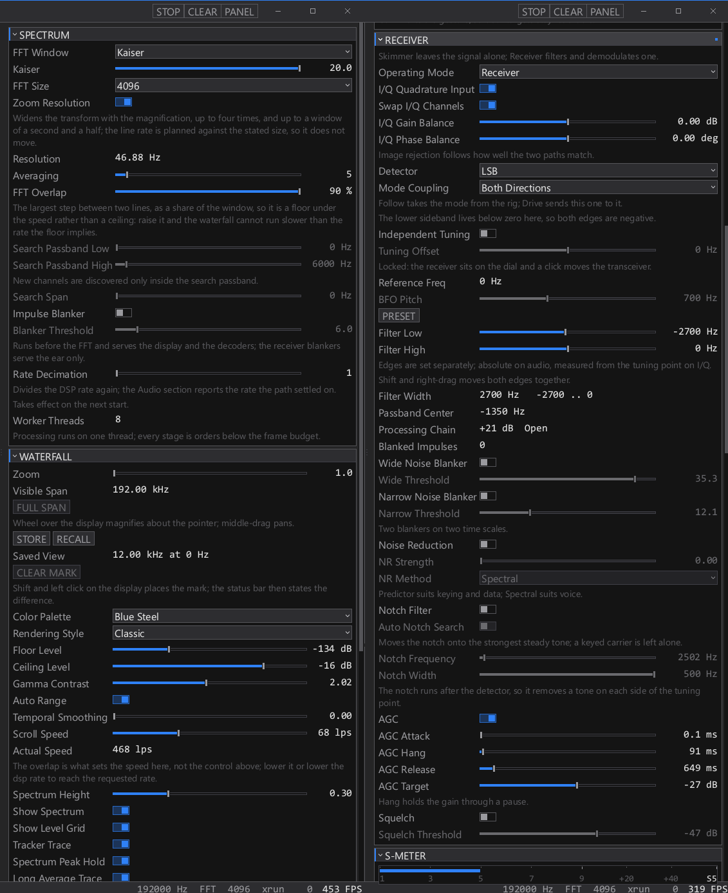
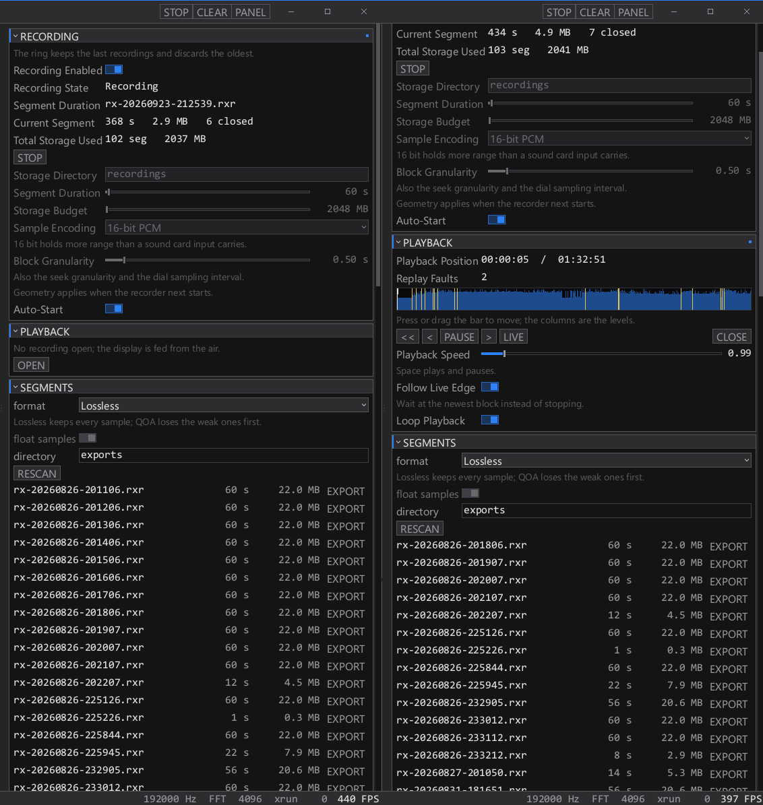

<p align="center">
  
</p>

# RXScope

Windows-native SDR receiver, spectrum analyzer, and multi-channel signal classifier. 

Developed primarily for the Xiegu G90 transceiver. Rig control relies on the internal Detent engine, which implements a specific subset of transceiver commands and is not a complete drop-in replacement for OmniRig.

Platform support is strictly limited to Windows. Requests regarding Linux compatibility, support, or ports will be ignored and redirected to the depths of the freedesktop ABI.



## Architecture

RXScope does not use external framework dependencies. Windowing relies directly on Win32 FFI, rendering runs on a custom Vulkan 1.1 pipeline, font handling uses a built-in TrueType parser and signed-distance/area rasterizer, and audio streaming interacts directly with WASAPI and waveIn.

The software operates in two distinct functional modes:

- Skimmer mode: Keeps incoming audio unaltered. Drives a bank of independent keying detectors across multiple carriers, decodes digital protocols, runs automatic mode classification, and logs station callsigns.
- Receiver mode: Operates as an SDR processing chain. Applies I/Q correction, software-defined tuning, filtering, demodulation (AM, SAM, FM, SSB, CW), noise blanking, spectral/predictive noise reduction, AGC with hang, and audio monitoring.



## Signal Processing

The signal processing engine runs on the render thread to ensure synchronous texture updates and zero-copy data presentation.

### Audio Ingestion
- Backends: WASAPI shared mode, WASAPI exclusive mode, loopback capture, and legacy waveIn.
- Channel routing: Left, Right, Mix, and Difference modes.
- Conditioning: Single-pole high-pass DC blocker (-3 dB at 20 Hz), linear gain control, and peak/RMS measurement before processing.
- Rate conversion: Windowed-sinc polyphase resampler converting arbitrary device rates (e.g. 44100 Hz, 48000 Hz, 192000 Hz) to the internal processing clock.
- Quadrature handling: Accepts direct I/Q stereo pairs with amplitude (-12 dB to +12 dB) and phase (-45 deg to +45 deg) manual balancing, or synthesizes analytic signals via a 63-tap Hilbert transform for real inputs.

### Spectral Analysis and Waterfall
- Transform sizes: Radix-2 FFT from 256 to 65536 points.
- Windowing functions: Rectangular, Hann, Hamming, Blackman, Blackman-Harris, Nuttall, FlatTop, and Kaiser (with configurable beta).
- Zoom resolution: Automatically increases FFT size with zoom factor up to four times nominal width to preserve line rates.
- Texture mapping: R8 single-channel texture mapped through a 256-entry palette in the fragment shader, minimizing PCIe bandwidth and allowing dynamic palette/gamma adjustments over past history.
- Horizontal tracking: Retains frequency alignment during dial changes without copying or clearing historical pixel buffers.
- Trace overlays: Real-time trace, decayed peak-hold trace, tracker search surface, and running average power trace.



## Demodulation and Decoding

### Receiver Chain (SDR Mode)
- Filtering: Complex bandpass filter with independent low and high frequency cutoffs relative to the tuning point.
- Demodulators: Upper Sideband (USB), Lower Sideband (LSB), Double Sideband AM, Synchronous AM (SAM with second-order PLL carrier recovery), FM (instantaneous phase discriminator), and CW (local beat oscillator).
- Interference reduction: Pre-filter wideband impulse blanker (0.5 ms window), post-filter narrow impulse blanker (4.0 ms window), manual biquad notch, and automatic tone-tracking notch.
- Noise reduction: Selectable LMS adaptive predictor (for periodic signals/CW) or multi-band spectral subtraction (for speech).
- Output AGC: Attack, hang timer (to prevent noise pumping during pauses), release, and target level controls, followed by an adjustable hysteresis squelch.

### Decoders (Skimmer Mode)
- CW: Multi-channel tracking bank (up to 16 concurrent channels). Uses Goertzel matched filters, median-filtered envelope followers, adaptive slicing thresholds, element ratio analysis, automatic speed tracking (5 to 60 WPM), and Farnsworth spacing detection.
- RTTY: Dual-tone matched discriminator, automatic baud rate estimation, automatic shift calculation, AFC, ATC (threshold correction for selective fading), and automatic polarity inversion detection. Supports Baudot (ITA2 with USOS) and 7/8-bit ASCII.
- PSK31: Differential BPSK demodulator, raised-cosine matched filter (31.25 baud), symbol timing recovery via envelope phase evaluation, and Varicode decoding.
- Signal classifier: Automatic identification of CW, RTTY, PSK31, and NAVTEX based on spectrum peak distributions and decoder confidence metrics.
- Station spotting: Offline callsign resolution via standard cty.dat prefix files and user-defined local databases, tracking frequency, SNR, WPM, and UTC timestamps.



## Storage and Replay

- Cyclic recorder: Writes continuous `.rxr` segment files to disk with pre-allocated block budgets.
- Metadata preservation: Embeds UTC timestamps, precise dial frequencies, software tuning offsets, reception modes, and signal levels into every block header (0.05 s to 5.0 s intervals).
- Paced replay: Replays past recordings through the DSP and decoder pipelines without display stalls, supporting variable speeds (0.25x to 8.0x), looping, and live-edge tracking.
- Export pipeline: Exports selected segments to standard uncompressed WAV (16-bit PCM or 32-bit float), custom lossless compressed audio (`.rxl`), or Quite OK Audio (`.qoa`).

## Rendering Subsystem

The visual interface is rendered via Vulkan 1.1 without third-party UI frameworks.

- Memory layout: Separate dynamic vertex, index, and staging buffers per in-flight frame.
- Batching: Merges draw primitives across panel boundaries based on texture handles and scissor rectangles.
- Text rendering: Custom TrueType font parser (`head`, `hhea`, `maxp`, `hmtx`, `loca`, `glyf`, `cmap`, `kern`) with analytic signed-area rasterization into a dynamic single-channel atlas.
- Window management: Custom non-client area handling for borderless styling with DPI-aware multi-monitor scaling.

## Building

Building requires the Vulkan SDK and a standard Rust toolchain (MSVC recommended).

The build script compiles GLSL shaders to SPIR-V using `glslc` or `glslangValidator` and packages Windows resource icons.

```bash
# Build release binary
cargo build --release
```

Environment variables recognized by `build.rs`:
- RXSCOPE_GLSLC: Explicit path to the `glslc` or `glslangValidator` executable.
- RXSCOPE_ICON: Path to an alternative `.ico` file.

## Configuration

Settings are stored in an INI file placed next to the binary (`rxscope.ini`). Missing keys are populated with defaults on startup.

```ini
[rig]
enabled = true
profile = g90-detent
port = COM5
baud = 19200
transport = direct
rf_axis = true

[receiver]
mode = skimmer
iq_input = false
detector = usb

[audio]
backend = wasapi
dsp_sample_rate = 12000
channel_mode = left
```

## License

This software is released under the Zero-Clause BSD (0BSD) License. Refer to the LICENSE file for details.